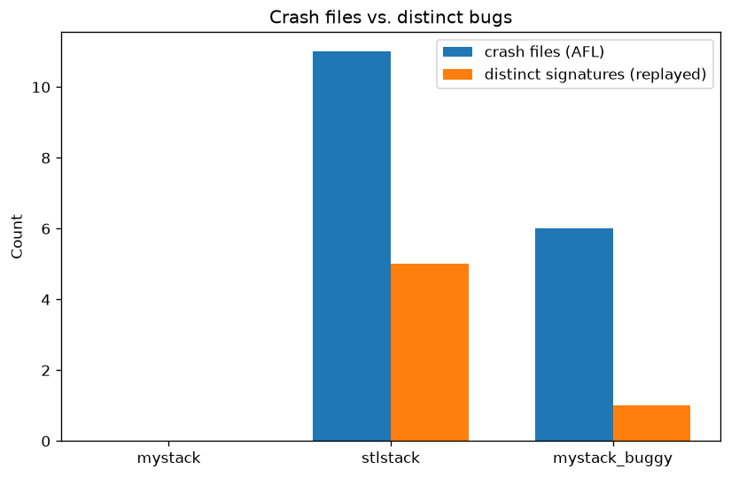

# AFL++ Campaign Analysis

## Comparison

| run | run_time | total_execs | execs_per_sec | corpus_paths | afl_unique_crashes | afl_unique_hangs | time_to_first_crash | replayed_crash_files | distinct_signatures |
| --- | --- | --- | --- | --- | --- | --- | --- | --- | --- |
| mystack | 0h15m02s | 145804 | 161.64 | 59 | 0 | 0 | n/a (no crashes) | 0 | 0 |
| stlstack | 0h15m01s | 42656 | 47.30 | 48 | 11 | 0 | 0h14m35s | 11 | 5 |
| mystack_buggy | 0h15m01s | 108647 | 120.55 | 52 | 6 | 0 | 0h00m15s | 6 | 1 |

## Charts

## Run: mystack

- AFL output dir: `out_mystack/default`
- Crash files: 0, hang files: 0
- No crashes reported by AFL++ for this run.

## Run: stlstack

- AFL output dir: `out_stlstack/default`
- Crash files: 11, hang files: 0
- Distinct crash signatures after replay: 5

| signature | count |
| --- | --- |
| UBSan: reference binding to misaligned address 0xbebebebebebec0ba for type 'const int', which requires 4 by | 5 |
| UBSan: execution reached an unreachable program point | 2 |
| UBSan: constructor call on misaligned address 0xbebebebebebec0b6 for type 'int', which requires 4 byte alig | 2 |
| UBSan: reference binding to misaligned address 0xbebebebebebec0a6 for type 'const int', which requires 4 by | 1 |
| UBSan: constructor call on misaligned address 0xbebebebebebebfc6 for type 'int', which requires 4 byte alig | 1 |

## Run: mystack_buggy

- AFL output dir: `out_mystack_buggy/default`
- Crash files: 6, hang files: 0
- Distinct crash signatures after replay: 1

| signature | count |
| --- | --- |
| exit_code:1 (no sanitizer text captured) | 6 |
